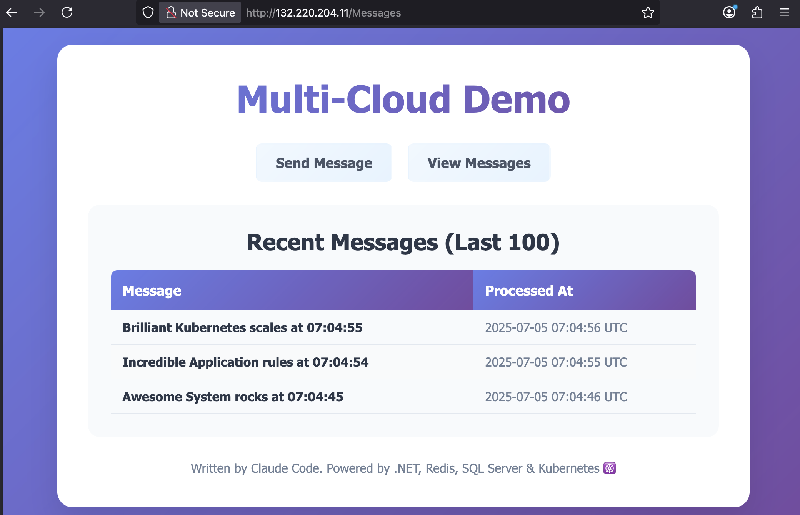
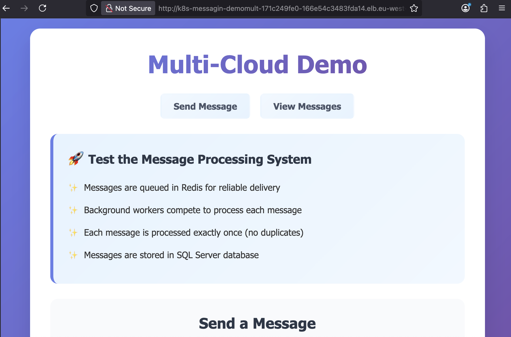

# Multi-Cloud Kubernetes Demo

A demonstration of deploying the same application across different Kubernetes environments - local Docker Desktop, Amazon EKS, and Azure AKS. The application showcases how Kubernetes enables true multi-cloud portability while leveraging cloud-specific features.

## Screenshots

### Azure AKS Deployment


### Amazon EKS Deployment  


## Architecture

This application showcases a microservices architecture with:

- **WebApp**: ASP.NET Core web application with Razor Pages
- **BackgroundWorker**: .NET background service processing messages  
- **Shared Library**: Common models and database context
- **Redis**: Message queue for reliable delivery
- **SQL Server**: Persistent storage for processed messages

## Container Image Configuration

This project supports flexible container registry and repository configuration for different deployment scenarios.

### Docker Compose

Configure images using environment variables in `.env` file:

```bash
# Copy the example and customize
cp .env.example .env

# Edit .env with your registry settings
REGISTRY=docker.io
REPOSITORY=sixeyed
TAG=2507
```

**Examples:**
- **Docker Hub**: `REGISTRY=docker.io` `REPOSITORY=your-username`
- **Azure ACR**: `REGISTRY=myregistry.azurecr.io` `REPOSITORY=myproject` 
- **Google GCR**: `REGISTRY=gcr.io` `REPOSITORY=my-gcp-project`
- **Amazon ECR**: `REGISTRY=123456789012.dkr.ecr.us-east-1.amazonaws.com` `REPOSITORY=my-repo`
- **Local development**: `REGISTRY=` `REPOSITORY=multi-cloud-demo`

### Helm Charts

Images are configured in the default `values.yaml` file:

```yaml
# Global image configuration
image:
  registry: "docker.io"    # Container registry
  repository: "sixeyed"    # Repository/namespace
  tag: "2507"              # Image tag
  pullPolicy: IfNotPresent

# Component image names
webapp:
  image:
    name: "multi-cloud-demo-webapp"

backgroundworker:
  image:
    name: "multi-cloud-demo-backgroundworker"
```

**Resulting image names:**
- **Default**: `docker.io/sixeyed/multi-cloud-demo-webapp:2507`

**Override at deployment time:**
```bash
# Use your own Docker Hub repository
helm install demo . -f values-local.yaml --set image.repository=myuser --set image.tag=latest
# Results in: docker.io/myuser/multi-cloud-demo-webapp:latest

# Use local development images (no registry)
helm install demo . -f values-local.yaml --set image.registry="" --set image.repository="multi-cloud-demo"
# Results in: multi-cloud-demo/multi-cloud-demo-webapp:2507

# Use a different registry entirely
helm install demo . --set image.registry=myregistry.azurecr.io --set image.repository=myproject
# Results in: myregistry.azurecr.io/myproject/multi-cloud-demo-webapp:2507

# Override component names if needed
helm install demo . --set webapp.image.name=my-webapp --set backgroundworker.image.name=my-worker
```

## Multi-Cloud Deployment

### Local Development (Docker Desktop)
- **Storage**: HostPath volumes for development
- **Load Balancer**: Docker Desktop built-in LoadBalancer
- **Resources**: Optimized for local development (2GB RAM for SQL Server)

```powershell
# Deploy locally
.\deploy-local.ps1 -Build -WatchLogs
```

### Amazon EKS
- **Storage**: GP3 EBS volumes with custom StorageClass
- **Load Balancer**: AWS Network Load Balancer (NLB)
- **Resources**: Production-grade (4GB RAM, 2 CPU for SQL Server)
- **Volumes**: 100GB persistent storage

```powershell
# Deploy to EKS (StorageClass included in chart)
.\deploy-eks.ps1 -Wait -WatchLogs
```

### Azure AKS  
- **Storage**: Premium LRS managed disks with custom StorageClass
- **Load Balancer**: Azure Load Balancer
- **Resources**: Production-grade (4GB RAM, 2 CPU for SQL Server)  
- **Volumes**: 100GB persistent storage

```powershell
# Deploy to AKS (StorageClass included in chart)
.\deploy-aks.ps1 -Wait -WatchLogs
```

## Storage Classes

StorageClasses are automatically created by the Helm chart based on the target environment:

### EKS - GP3 Storage Class
- **Provisioner**: `ebs.csi.aws.com`
- **Type**: GP3 with 3000 IOPS, 125 MB/s throughput
- **Encryption**: Enabled
- **Volume Binding**: WaitForFirstConsumer

### AKS - Premium LRS Storage Class  
- **Provisioner**: `disk.csi.azure.com`
- **Type**: Premium_LRS managed disks
- **Caching**: ReadOnly mode
- **Volume Binding**: WaitForFirstConsumer

## Quick Start

### Prerequisites
- Docker Desktop (for local development)
- PowerShell 7+ (cross-platform)
- Helm 3.x
- kubectl

### Deploy Locally
```bash
# Build and deploy to Docker Desktop
./deploy-local.ps1 -Build -Wait
```

### Deploy to Cloud

#### Azure AKS
```bash
# Create AKS infrastructure
cd terraform
./deploy-aks-infra.ps1

# Deploy application
cd ..
./deploy-aks.ps1 -Wait
```

#### Amazon EKS  
```bash
# Create EKS infrastructure
cd terraform
./deploy-eks-infra.ps1

# Deploy application
cd ..
./deploy-eks.ps1 -Wait
```

## Configuration Differences

| Feature | Local | EKS | AKS |
|---------|-------|-----|-----|
| **Storage** | hostpath (5GB) | gp3 (100GB) | premium-lrs (100GB) |
| **Load Balancer** | Docker Desktop | AWS NLB | Azure LB |
| **SQL Server Resources** | 2GB RAM, 1 CPU | 4GB RAM, 2 CPU | 4GB RAM, 2 CPU |
| **Background Workers** | 3 replicas | 5 replicas | 5 replicas |
| **Web App Replicas** | 2 replicas | 3 replicas | 3 replicas |
| **Redis Persistence** | Disabled | 20GB gp3 | 20GB premium-lrs |

## Terraform Infrastructure

The `terraform/` directory contains infrastructure as code for both cloud providers:

### Install Prerequisites
```bash
# Install all required tools (Terraform, AWS CLI, Azure CLI)
cd setup/tools
./install-all.ps1  # Detects OS and installs appropriate versions
```

### AWS Setup
```bash
cd setup/cloud
./setup-aws.ps1  # Configure AWS credentials
```

### Azure Setup  
```bash
cd setup/cloud
./setup-azure.ps1  # Login to Azure
```

## Monitoring and Troubleshooting

### Check Deployment Status
```bash
kubectl get pods -n messaging-demo
kubectl get pvc -n messaging-demo
kubectl get storageclass
```

### View Logs
```bash
# Background worker logs
kubectl logs -l app.kubernetes.io/component=backgroundworker -n messaging-demo -f

# Web app logs
kubectl logs -l app.kubernetes.io/component=webapp -n messaging-demo -f

# SQL Server logs
kubectl logs -l app.kubernetes.io/component=sqlserver -n messaging-demo -f
```

### Access Application
```bash
# Get LoadBalancer URL
kubectl get service demo-multi-cloud-demo-webapp -n messaging-demo

# Port forward for testing
kubectl port-forward svc/demo-multi-cloud-demo-webapp 8080:80 -n messaging-demo
```

## Key Kubernetes Features Demonstrated

- **Multi-cloud Storage**: Custom StorageClasses for different cloud providers
- **Health Probes**: Startup, readiness, and liveness probes
- **ConfigMaps**: JSON configuration with Helm templating  
- **Secrets**: Secure password management
- **Resource Management**: CPU/memory limits and requests
- **Persistent Volumes**: Database and cache persistence
- **Load Balancers**: Cloud-native load balancing
- **Init Containers**: Dependency management
- **Horizontal Scaling**: Multiple replicas with load distribution

## Development Workflow

1. **Local Development**: Use `deploy-local.ps1` for rapid iteration
2. **Cloud Testing**: Deploy to EKS/AKS to test cloud-specific features
3. **CI/CD Integration**: Scripts can be integrated into pipelines

## Clean Up

```bash
# Remove deployment
helm uninstall demo -n messaging-demo

# Remove namespace
kubectl delete namespace messaging-demo

# Remove StorageClass (if needed)
kubectl delete storageclass gp3-storage-class        # EKS
kubectl delete storageclass premium-lrs-storage-class # AKS
```

---

## 🤖 Built with Claude Code

This application demonstrates consistent deployment patterns across multiple Kubernetes environments, showcasing true multi-cloud portability with cloud-specific optimizations.